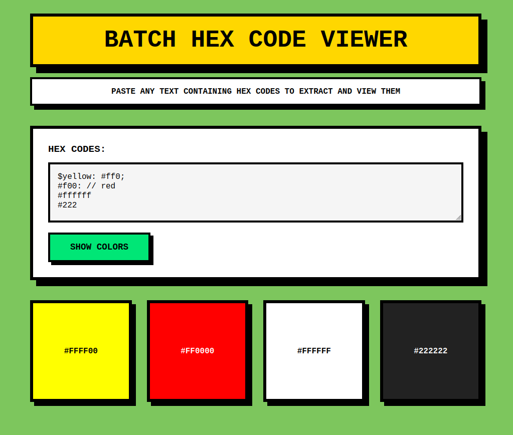
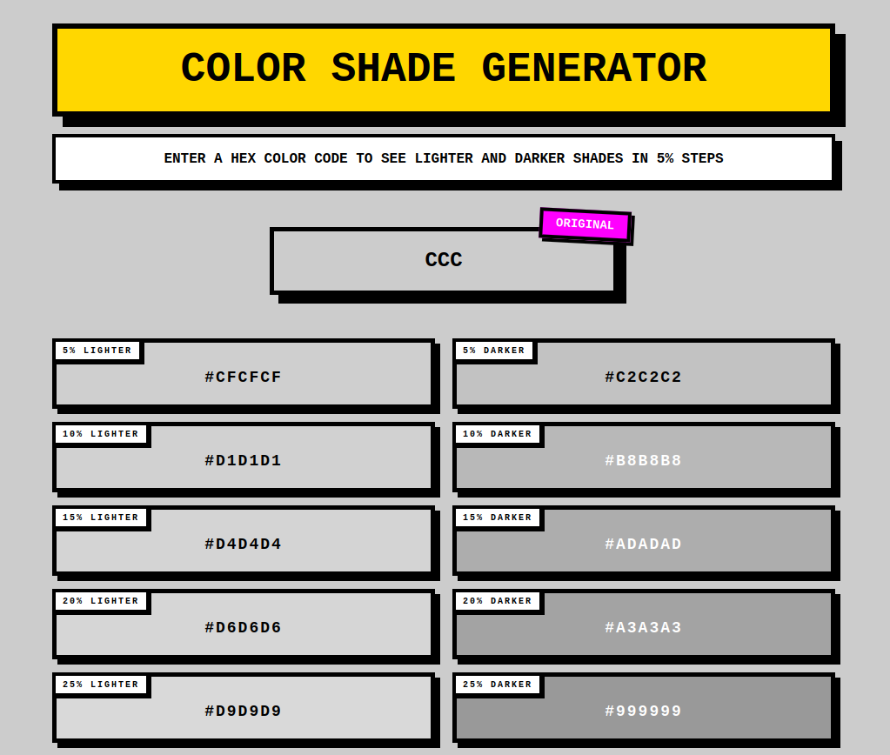
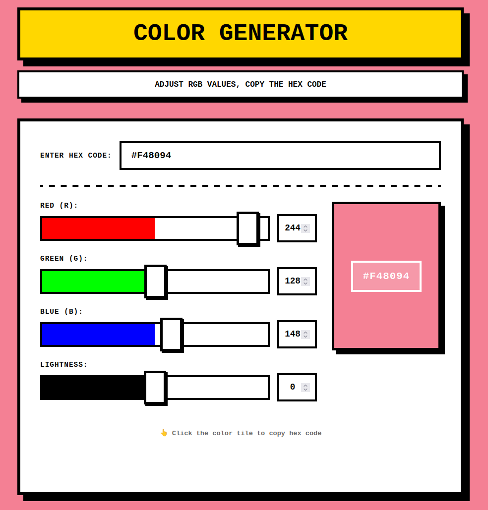

<h1 style="font-size: 48px; font-weight: 900; text-transform: uppercase; color: #000; border: 6px solid #000; padding: 20px 30px; background-color: #FFD700; box-shadow: 12px 12px 0 #000; margin-bottom: 20px; text-align: center;">COLOR TOOLS</h1>

A collection of web tools with neobrutalist design

<h2 style="font-size: 24px; font-weight: 900; text-transform: uppercase; color: #000; border: 4px solid #000; padding: 15px 20px; background-color: #00E676; box-shadow: 6px 6px 0 #000; margin-bottom: 20px; text-align: center;">BATCH HEX CODE VIEWER</h2>

Paste any text containing hex codes to extract and view them as interactive color tiles. Perfect for quickly visualizing color palettes from CSS files, design documents, or any text source.

<ul style="font-weight: bold; text-transform: uppercase; margin-left: 20px;">
<li>Extract hex codes from any text</li>
<li>Supports 3-digit and 6-digit formats</li>
<li>Click tiles to copy hex codes</li>
<li>WCAG compliant text contrast</li>
</ul>

<h2 style="font-size: 24px; font-weight: 900; text-transform: uppercase; color: #000; border: 4px solid #000; padding: 15px 20px; background-color: #FF00FF; box-shadow: 6px 6px 0 #000; margin-bottom: 20px; text-align: center;">COLOR SHADE GENERATOR</h2>

Enter a hex color code to see lighter and darker shades in 5% steps. Perfect for creating consistent color palettes and finding the perfect shade variations.

<ul style="font-weight: bold; text-transform: uppercase; margin-left: 20px;">
<li>5% incremental shade steps</li>
<li>Lighter and darker variations</li>
<li>Click any shade to copy hex code</li>
<li>Dynamic background color changes</li>
</ul>

<h2 style="font-size: 24px; font-weight: 900; text-transform: uppercase; color: #000; border: 4px solid #000; padding: 15px 20px; background-color: #FF6B6B; box-shadow: 6px 6px 0 #000; margin-bottom: 20px; text-align: center;">COLOR GENERATOR</h2>

Start with a color or create your own with simple RGB sliders. Includes lightness adjustment and real-time hex code generation for precise color control.

<ul style="font-weight: bold; text-transform: uppercase; margin-left: 20px;">
<li>RGB sliders with live preview</li>
<li>Lightness adjustment control</li>
<li>Manual hex code input</li>
<li>Click color tile to copy code</li>
</ul>

<h2 style="font-size: 24px; font-weight: 900; text-transform: uppercase; color: #000; border: 4px solid #000; padding: 15px 20px; background-color: #FF9800; box-shadow: 6px 6px 0 #000; margin-bottom: 20px; text-align: center;">IPSUM GENERATORS</h2>

Themed Lorem Ipsum generators with specialized vocabulary. Choose from plant-based words or skateboarding tricks for unique placeholder text.

<ul style="font-weight: bold; text-transform: uppercase; margin-left: 20px;">
<li>200+ themed words each</li>
<li>Random paragraph lengths</li>
<li>Customizable paragraph count</li>
<li>Random background colors</li>
<li>Keyboard shortcuts</li>
</ul>

<a href="https://jasonkunc.github.io/tools/ipsum/vegan-ipsum.html" style="display: block; text-decoration: none;">

VEGAN IPSUM

</a>
<a href="https://jasonkunc.github.io/tools/ipsum/skate-ipsum.html" style="display: block; text-decoration: none;">

SKATE IPSUM

</a>

